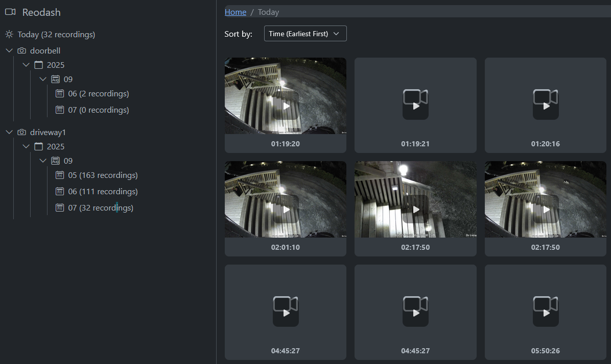

# Reodash

Minimal self-hosted UI to browse and play camera recordings. Folder-based browser, grid thumbnails, and on‑the‑fly HLS playback.



## Features

- Browse by camera/year/month/day plus a Today aggregate
- Grid thumbnails; modal player with HLS (ffmpeg) and MP4 fallback
- No database; reads directly from your recordings directory

## File Structure Expected

Reodash expects recordings to be organized as follows:

```
/recordings/
├── <camera_device_name>/
│   └── <year>/          # e.g., 2024
│       └── <month>/     # e.g., 09
│           └── <day>/   # e.g., 05
│               ├── Driveway_00_20250905173157.jpg  # Thumbnail
│               └── Driveway_00_20250905173157.mp4  # Video
```

## Docker Usage

### Quick start

Build the image:
```bash
docker build -t reodash .
```

Run the container:
```bash
docker run --name reodash \
  -p 5000:5000 \
  -v /path/to/your/recordings:/recordings:ro \
  -e RECORDINGS_PATH=/recordings \
  reodash
```

Replace `/path/to/your/recordings` with the actual path to your camera recordings directory.

The application will be available at `http://localhost:5000`

### docker-compose (optional)

```yaml
version: "3.8"
services:
  reodash:
    build: .
    ports:
      - "5000:5000"
    volumes:
      - /path/to/your/recordings:/recordings:ro
    environment:
      - RECORDINGS_PATH=/recordings
    restart: unless-stopped
```

## Environment Variables

- `RECORDINGS_PATH`: Path to recordings directory (default: `/recordings`)
- `HLS_PATH`: Ephemeral directory for generated HLS segments (default: `/tmp/reodash_hls`). Files are removed when playback ends.
- `LOG_LEVEL`: Logging level, e.g. `DEBUG`, `INFO`, `WARNING` (default: `INFO`)

## Development

To run locally without Docker:

```bash
pip install -r requirements.txt
export RECORDINGS_PATH=/path/to/your/recordings
gunicorn --bind 0.0.0.0:5000 app:app --workers 2 --threads 4 --timeout 180
```